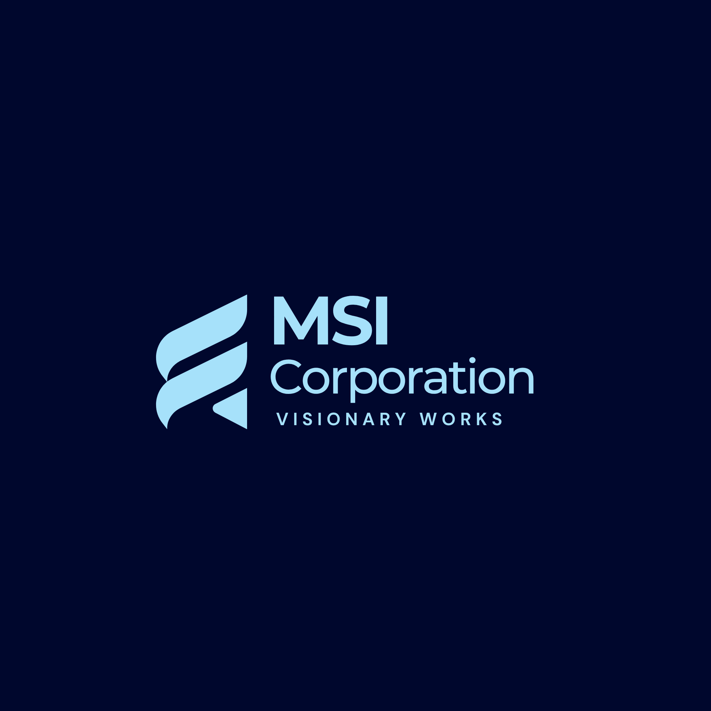

# MSI Corporation Logo Kit

This repository contains official logo files for MSI Corporation.

## ✅ Usage

- Use PNGs for websites, documents, and presentations.
- Use SVGs for scalable print materials or app UI.

## 🎨 Brand Colors (HEX)

- Primary Blue: `#0A2472`
- Strong Blue: `#0E6BA8`
- Light Blue: `#A6E1FA`
- Deep Navy: `#00072D`
- Rich Navy: `#001C55`

## 📁 Files

- `/png/` – PNG versions (transparent and colored backgrounds)
- `/svg/` – Vector (SVG) versions

## 💡 Notes

- Do not stretch or alter the logo proportions.
- Maintain clear space around the logo.

## Primary logo on dark background

